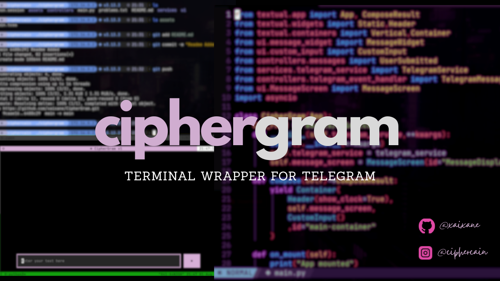
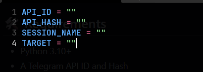

# 📬 CipherGram

A professional, terminal-based Telegram client built using [Textual](https://github.com/Textualize/textual) and [Telethon](https://github.com/LonamiWebs/Telethon). CipherGram focuses on simplicity, real-time message handling, and a responsive TUI experience.

---

## 🚀 Features

- 📡 Real-time message sending and receiving
- 🧠 Asynchronous Telegram login with 2FA support
- 💬 Custom UI with scrollable message display and input box
- 🪄 Built with Python, Textual, and Telethon
- 💻 Minimal and hackable — perfect for power users

---

## 🛠️ Requirements

- Python 3.10+
- A Telegram API ID and Hash  
  [Get them here](https://my.telegram.org/auth)

---

## 📦 Installation

```bash
git clone https://github.com/yourusername/ciphergram.git
cd ciphergram
pip install -r requirements.txt
```
---

## Important Before Running

1. Create a .env file in the same folder as main.py 

2. Add your 
    [-] Telegram API Key
    [-] Telegram API Hash
    [-] Session Name(it can be anything)
    [-] Target you wanna send and recieve messages.

Below is a screenshot for reference.



---
## 🔐 First-Time Login

When you run the app for the first time:

1. Enter your **phone number** when prompted.  
2. Enter the **verification code** sent to your Telegram app.  
3. If you have **two-factor authentication (2FA)** enabled, you'll also be asked for your password.  
4. Once verified, your session is saved, and you'll stay logged in.

---

## ▶️Running the App

```bash
python main.py
```

---

## Project Structure

```bash
ciphergram/
├── main.py                    # App entry point
├── services/
│   └── telegram_service.py    # Telegram connection & login logic
├── controllers/
│   └── messages.py            # Custom event classes
├── ui/
│   ├── MessageScreen.py       # Message display widget
│   ├── custom_input.py        # Custom text input
│   └── message_widget.py      # Individual message rendering
├── assets/
│   └── screenshot.png         # App screenshot
├── README.md
└── requirements.txt
```

---

## 👨💻 Author

Built with ❤️ by xaixane

Instagram: [@ciphercain](https://www.instagram.com/ciphercain/)
LinkedIn:  [@SaiGaneshM](https://www.linkedin.com/in/sai-ganesh-8489ab259/)
Github: [@xaixane](https://github.com/xaixane)


